class: center, inverse

# .alert[**Raccogliere, gestire e analizzare dati**]
## Introduzione ai software

```{r, echo=FALSE, out.width = "20%"}
knitr::include_graphics(c("img/R_logo.png"))
```

```{r, echo=FALSE, out.width = "30%"}
knitr::include_graphics(c("img/RStudio-Logo-Flat.png"))
```

```{r, echo=FALSE, out.width = "30%"}
knitr::include_graphics(c("img/jamovi-logo.svg"))
```

<br>

<small>
Scuola di Specializzazione in Scienze dell'Alimentazione

\- Padova, 2020/09/28 -


```{r setup, echo=FALSE}
library(xaringanExtra)
library(metathis)
library(countdown)

knitr::opts_chunk$set(
  message = FALSE,
  comment = "",
  fig.dim  = c(5, 4.5),
  out.width = "100%"
)
options(width = 59) # fit into the rigth-column slides
```

```{r style-share-again, echo=FALSE}
style_share_again(
  share_buttons = c("twitter", "linkedin", "pocket")
)
```

```{r xaringanExtra-clipboard, echo=FALSE}
xaringanExtra::use_clipboard()
```

```{r xaringan-editable, echo=FALSE}
xaringanExtra::use_editable(expires = 1)
```

```{r meta, echo=FALSE}
meta() %>%
  meta_general(
    description = "Raccogliere, gestire ed analizzare dati: Introduzione ai software R, RStudio e Jamovi",
    generator = "xaringan and remark.js"
  ) %>% 
  meta_name("github-repo" = "UBESP-DCTV/intro-r-rstudio-jamovi") %>% 
  meta_social(
    title = "Raccogliere, gestire ed analizzare dati",
    url = "https://ubesp-dctv.github.io/intro-r-rstudio-jamovi/",
    image = "https://github.com/UBESP-DCTV/intro-r-rstudio-jamovi/raw/master/img/concept-map-14.PNG",
    og_type = "website",
    og_author = "UBEP",
    twitter_card_type = "summary",
    twitter_creator = "@CorradoLanera"
  )
```

```{css, echo=FALSE}
pre {
  max-width: 100%;
  overflow-x: scroll;
}

.inverse {
  background-color: #272822;
  color: #d6d6d6;
  text-shadow: 0 0 20px #333;
}

.left-code {
  color: #777;
  width: 38%;
  height: 92%;
  float: left;
}

.right-code {
  color: #777;
  width: 55%;
  height: 92%;
  float: right;
  padding-top: 0.5em;
}

.left-plot {
  width: 43%;
  float: left;
}

.right-plot {
  width: 60%;
  float: right;
}

.remark-code {
  font-size: 60%;
}
```


???

Buongiorno a tutti e benvenuti a questa lezione sui software utili per
l'analisi statistica. In particolare, oggi introdurremo i software
R, RStudio e Jamovi.


---
class: inverse, center, bottom


.right[

```{r, echo=FALSE, out.width = "40%"}
knitr::include_graphics(c("img/profilo_CL.jpg"))
```

# Potete contattarmi su...

[`r icon::fa("envelope")`](mailto:corrado.lanera@unipd.it) [corrado.lanera@unipd.it](mailto:corrado.lanera@unipd.it)

[`r icon::fa("link")`](https://www.CorradoLanera.it) [CorradoLanera.it](https://www.CorradoLanera.it)

[`r icon::fa("twitter")`](https://twitter.com/corradolanera) [@CorradoLanera](https://twitter.com/corradolanera)

[`r icon::fa("telegram-plane")`](https://telegram.me/CorradoLanera) [@CorradoLanera](https://telegram.me/CorradoLanera)
]


???

Io sono Corrado Lanera, ricercatore presso l'Unità di Biostatistica,
Epidemiologia e Sanità Pubblica dell'Università di Padova, sono un
appassionato di R, e nei prossimi 40 minuti cercherò di farvi una
panormaica sulle caratteristiche e potenzialità di questo software oltre
che di altri due programmi (RStudio e Jamovi) che vi potranno permettere
di utilizzarlo con facilità.


GOTO slide 7 (`7 + <RETURN>`)


---

# Learner persona: *Med Newbe*


### .center[In Breve]

**Med** è uno specializzando dell'area medica che necessita degli
strumenti di base di biostatistica, sia informatici che teorici. 


### .center[Background Generale]

Quasi certamente non è a digiuno completo né riguardo ai metodi
statistici né ad alcuni software collegati, avendoli sicuramente 
trattati durante il percorso di laurea. Del resto, il tempo passato da
quei corsi, oltre alle altre sue priorità su temi specifici della
specializzazione, è probabile abbiano cancellato molto di tali 
competenze, specialmente quelle informatiche.


### .center[Conoscenze Rilevanti]

Ambito  | Statistica | Programmazione 
:------:|:----------:|:--------------:
Esperto | Competente | Novizio      


---

# Learner persona: *Med Newbe*

### Punto di partenza

- Comincia a essere attivo nella produzione scientifica ad alto livello.
  
- Ha nozioni base di biostatistica derivanti dai corsi della laurea 
  triennale e magistrale, molti dei quali un po' _assopiti_ e facilmente
  distorti da esempi e richieste della pubblicazione clinica.
  
- Per le analisi, fin'ora ha utilizzato fogli di calcolo (Excell).
  
- Comincia a conoscere quali analisi sono richieste dalle riviste
  specializzate per pubblicare le ricerche di cui si occupa (anche
  quando non ne padroneggia il significato o l'interpretazione).

- Ha sentito parlare di R, usato nei corsi di statistica durante la
  laurea. Probabilmente lo ha visto da riga di comando, ma il ricordo 
  resta confuso.
  
- Non conosce RStudio (né il `{tidyverse}`), o pensa comunque sia un
  altro modo di chiamare R.

- Mai sentito parlare di Jamovi.
  


---

# Learner persona: *Med Newbe*

### Necessità

- Capire l'utilità di R e gli usi che potrebbe farne per i suoi
  interessi:
   - analisi
   - grafici
   - report
  
- Conoscere alcuni strumenti (di uso il più intuitivo possibile) per
  poter ottenere velocemente risultati utilizzabili e al contempo 
  moderni e riproducibili.


### Osservazioni particolari

- Piuttosto restio alla tecnologia, come altri dei suoi colleghi pensa
  di "non essere portato per la... (matematica, informatica, ...)". Alto 
  rischio di percepire il corso solo come "da fare per ottenere il
  titolo" e dimenticare tutto poco dopo. Fondamentale quindi introdurre
  pochi concetti base, chiari, stabili e che possano essere per lo 
  più permanenti.


---
class: inverse

# Learning (and lesson) objectives

1. **Understand** what are R, RStudio, and Jamovi
   (and in what they differ).

2. **Learn** how to install them and for what they can be used.

3. **View** and **Apply** basic operations like:

  - **R**: algebra, assignment, packages, built-in functions
  
  - **RStudio**: projects, editor, console, file, viewer, notebooks
  
  - **Jamovi**: data, load, analyses, modules, plots, reports


---
class: inverse, center

# Cosa faremo

Questi 40 minuti vi forniranno un'introduzione all'uso di
**R** (tramite **RStudio**) e di **Jamovi**.

In particolare, vedremo cosa sono, in cosa si differenziano, e come
installarli. Vedremo inoltre alcuni esempi pratici di applicazione per
la produzione di analisi, grafici e report.

L'obiettivo principale sarà quello di fornirvi gli elementi base per
seguire future lezioni condotte con tali software, oltre che cominciare
a esplorarli e utilizzarli in autonomia.


???


---
class: inverse, middle, center

# Panoramica

---

<br>

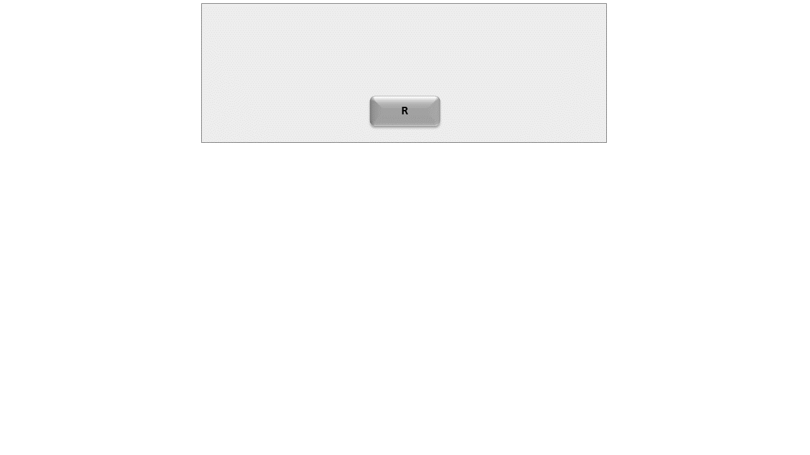

---

<br>

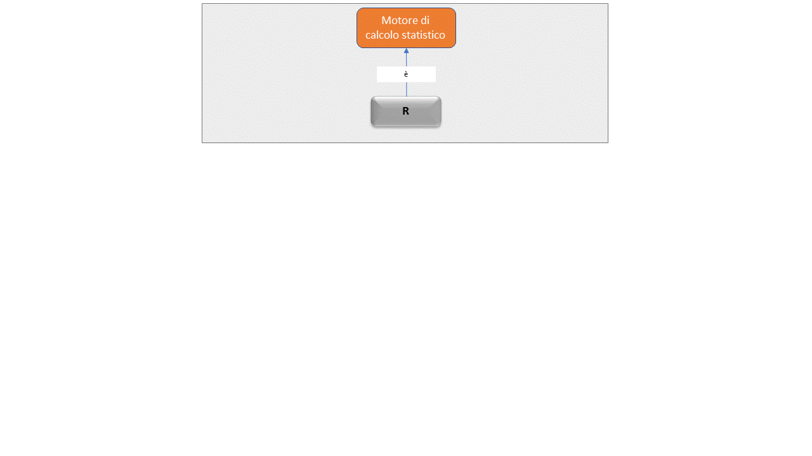

---

<br>

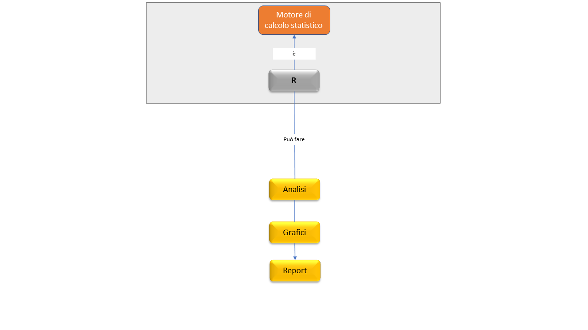

---

<br>

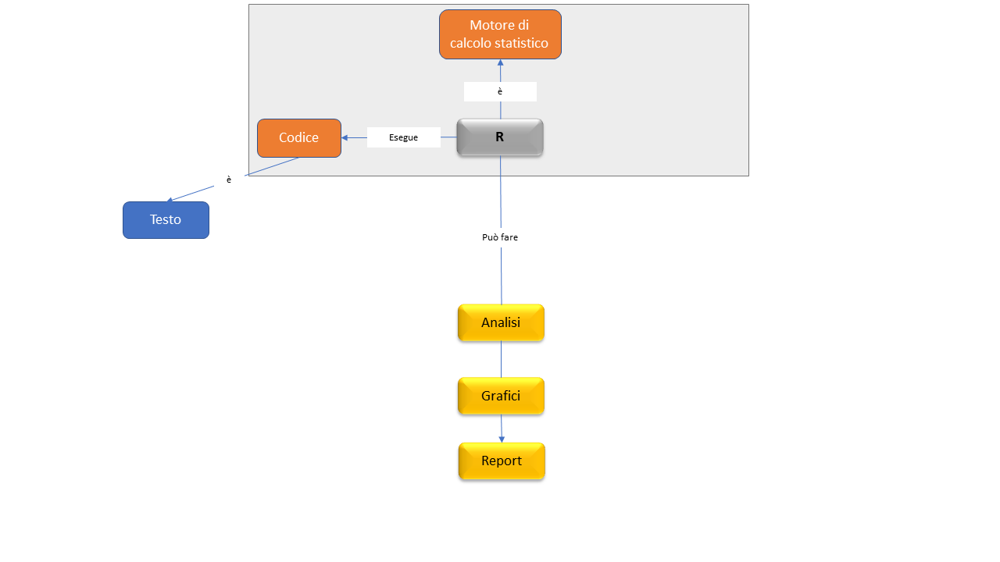

---

<br>

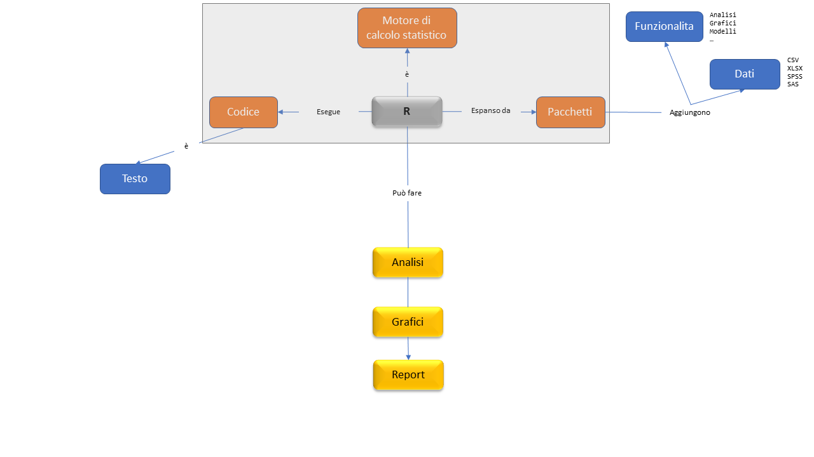

---

<br>

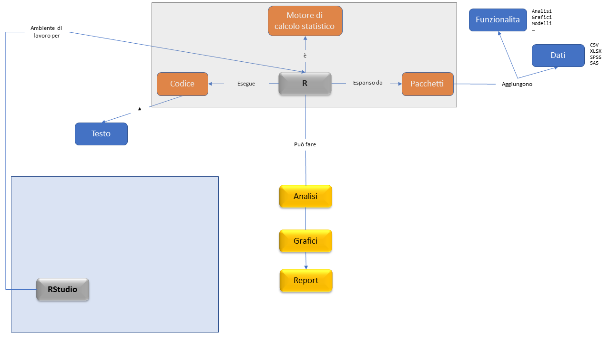

---

<br>

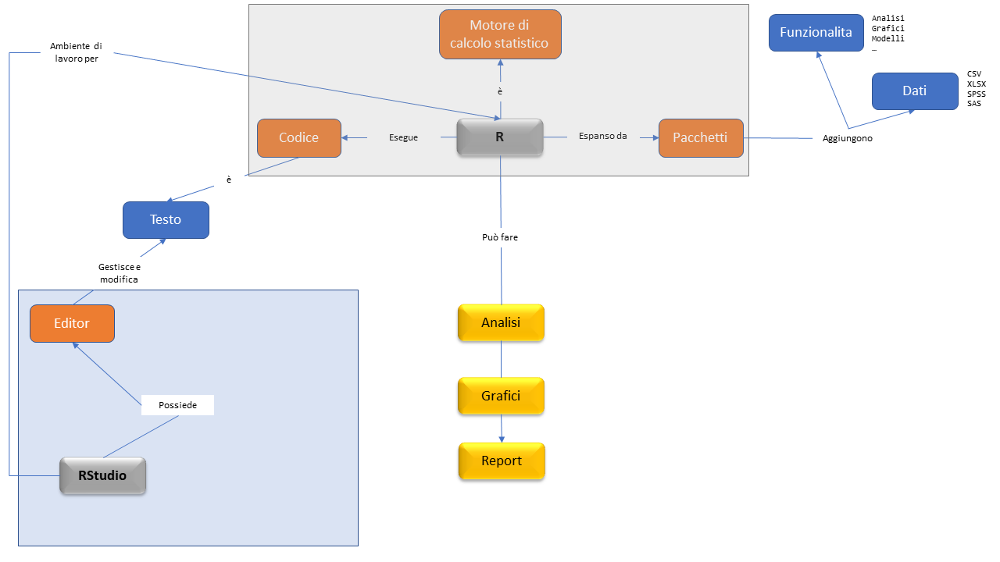

---

<br>

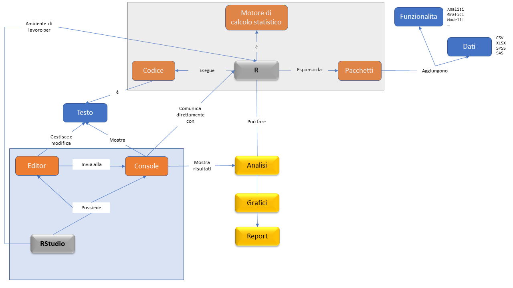

---

<br>

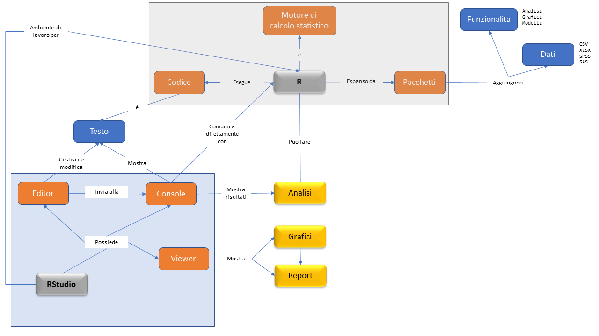

---

<br>

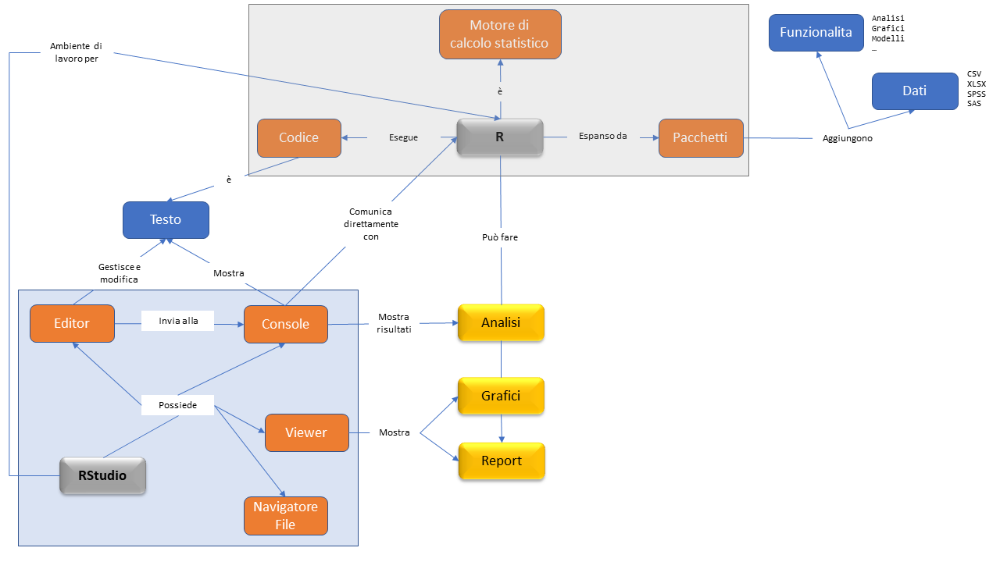

---

<br>

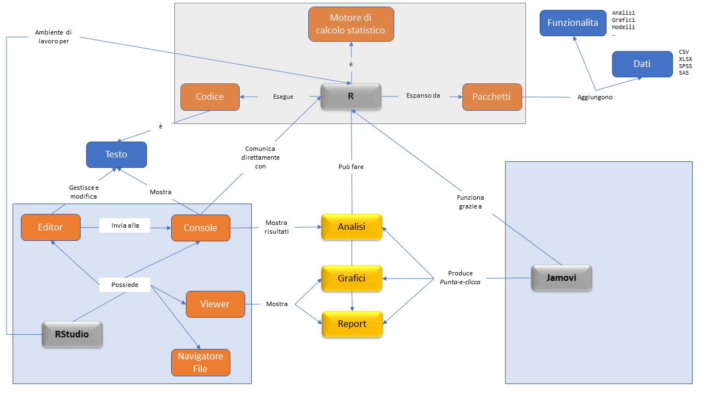

---

<br>

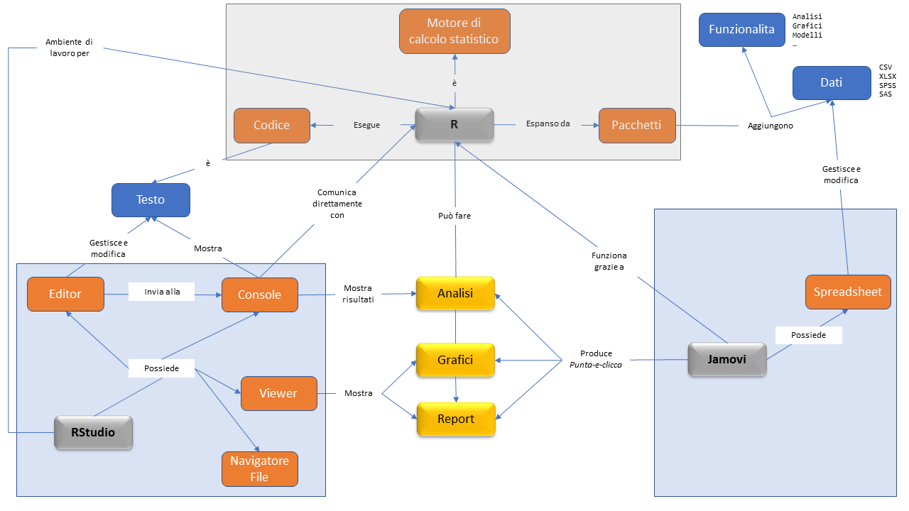

---

<br>

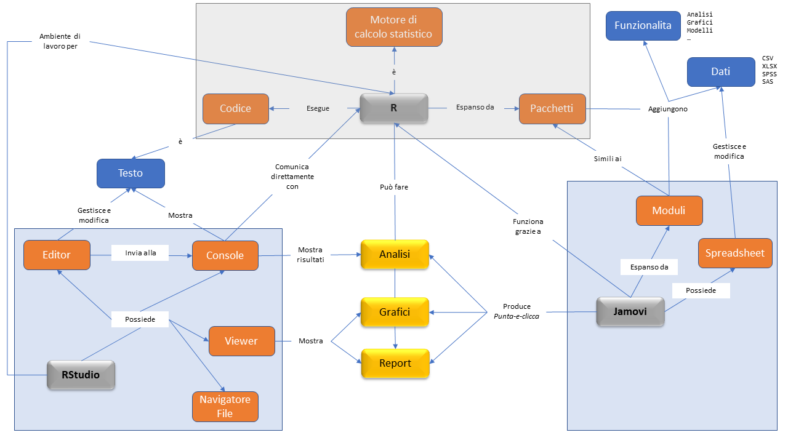


---

<br>

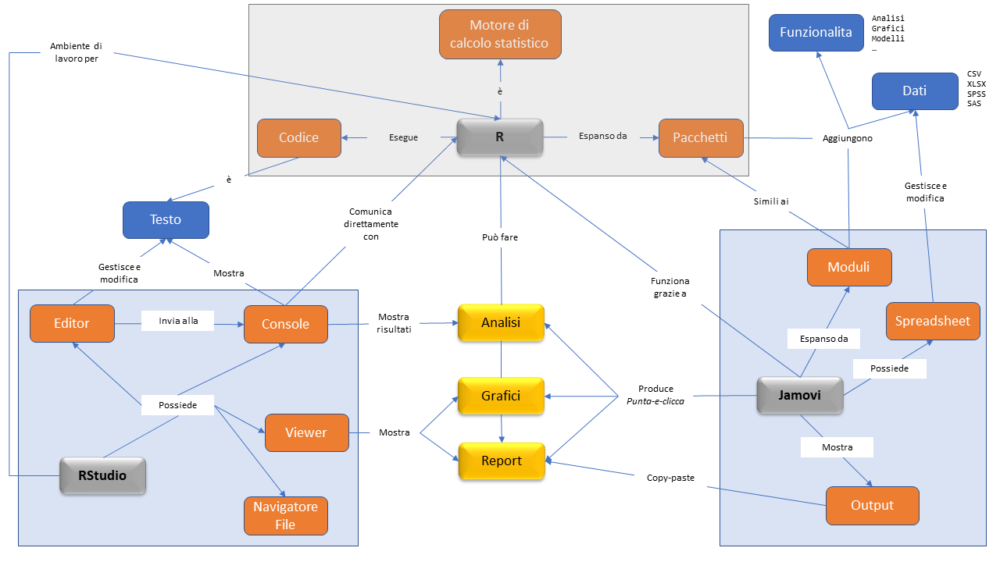


---
class: inverse, middle, center

```{r, echo=FALSE, out.width = "20%"}
knitr::include_graphics(c("img/R_logo.png"))
```


---
# Installazione

## Go to: https://cloud.r-project.org/

```{r, echo=FALSE}
knitr::include_url("https://cloud.r-project.org/")
```

---
# Basi di utilizzo

## Semplice algebra

In R possiamo operare tutte le operazioni algebriche di base, e anche di
più! Ottimo quindi anche come calcolatrice potenziata!

.left-code[
```{r algebra, eval=FALSE}
1 + 1  # sum

7 * 3  # product

abs(-2)  # absoulte value

3^2  # power
sqrt(9)  # squared root
```
]

.right-plot[

```{r, echo=FALSE}
knitr::include_app("https://corradolanera.shinyapps.io/pure-r/")
```

]


---
# Basi di utilizzo

## Vettori

La struttura base dei dati in R è il vettore: sequenze di numeri

.left-code[
```{r vectors, eval=FALSE}
first_vector <- 1:1000
first_vector

# inspect some elements of a big object
head(first_vector)
tail(first_vector)

# already seen
str(first_vector)
```
]

.right-plot[

```{r, echo=FALSE}
knitr::include_app("https://corradolanera.shinyapps.io/pure-r/")
```

]


---
# Basi di utilizzo

## Assegnamento

Spesso può essere utile salvare il risultato di una operazione o della
chiamata di una funzione in un oggetto (che chiamiamo **variabile**) a
cui possiamo assegnare un nome.

.left-code[
```{r assignment, eval=FALSE}
c(1, 2, 3, 7)  # concatenate

1:7  # sequence

seq_len(4)  # sequence

rep(2, 3)  # replicate

rev(c(1, 2, 3))  # reverse
```
]

.right-plot[

```{r, echo=FALSE}
knitr::include_app("https://corradolanera.shinyapps.io/pure-r/")
```

]

---

## Logica

Possiamo anche fare operazioni con vettori logici `TRUE`/`FALSE`

.left-code[
```{r logic, eval=FALSE}
1 == 0
1 != 0
1 > 0
1 <= 0


TRUE & FALSE
TRUE | FALSE
!TRUE

which(c(1, 2, 3, 3, 2, 4) == 2)
```
]

.right-plot[

```{r, echo=FALSE}
knitr::include_app("https://corradolanera.shinyapps.io/pure-r/")
```

]


---

## Fattori

Per rappresentare variabili categoriali, R mette a disposizione i
**`factor`**.

.left-code[
```{r factor, eval=FALSE}
gender_factor <- factor(
  c('female', 'unknown', 'female'),
  levels = c('female', 'male', 'unknown')
)

gender_factor
levels(gender_factor)

table(gender_factor)
```
]

.right-plot[

```{r, echo=FALSE}
knitr::include_app("https://corradolanera.shinyapps.io/pure-r/")
```

]


---
## Dataframe

Per rappresentare basi di dati, la struttura tabellare in cui:
- ogni riga è una osservazione (es: un paziente, o una visita)
- ogni colonna è una variabile (es: il genere, o l'età)

si chiama **`dataframe`** e lo costruiamo con la funzione `data.frame()`
a cui passiamo le variabili di nostri interesse con il loro contenuto.

.left-code[
```{r df, eval=FALSE}
first_df <- data.frame(
  id     = c(7, 12, 31),
  gender = factor(
      c('m', 'm', 'f'),
      levels = c('f', 'm', 'u')
  ),
  city   = c('Gorizia', 'Viterbo', 'Napoli'),
  height = c(1.84, 1.70, 1.59),
  weight = c(85, 90, 71)
)

first_df

first_df["gender"]
first_df[c("gender", "city")]

first_df$gender
```
]

.right-plot[

```{r, echo=FALSE}
knitr::include_app("https://corradolanera.shinyapps.io/pure-r/")
```

]


---
background-image: url(img/culmen_depth.png)
background-position: 100% 0%
background-size: 26%

## Pacchetti

Un pacchetto di espansione di R è una collezione di funzioni e/o di 
dati che possono essere "aggiunti" al proprio ambiente di lavoro.

Si installano una sola volta (salvo aggiornamenti) ma si caricano ogni
volta che si ricomincia a lavorare.

.left-code[
```{r pkgs, eval=FALSE}
# installare nuovi pacchetti, cioè download, e memorizzazione in una
# libreria di pacchetti nel computer. NON viene caricato un pacchetto
# quando è installato!
# install.packages('tidyverse')      # funzioni per analisi di dati
# install.packages('palmerpenguins') # dati relativi a pinguini antartici

# caricare un pacchetto (che deve essere presente nol computer, cioè
# installato) fa in modo di poter usare tutte le funzioni (o dati) al
# suo interno.
library('tidyverse')
library('palmerpenguins')

penguins %>% 
  ggplot(aes(
    x = bill_length_mm,
    y = bill_depth_mm,
    color = species)) +
  geom_point() +
  geom_smooth(method = lm)
```
]

.right-plot[

```{r, echo=FALSE}
knitr::include_app("https://corradolanera.shinyapps.io/pure-r/")
```

]


---
class: inverse, center

# ---Your-Turn-->

Clicca [QUÌ](https://corradolanera.shinyapps.io/free-r/) <sup>\*</sup>
per sperimentare in R quanto visto fin'ora.


```{r, echo = FALSE}
countdown(minutes = 7, warn_when = 1, play_sound = TRUE,
          left = "34%", bottom = "50%")
```

<br><br><br><br>

<small><small><small><small>Click the timer to start the countdown</small></small></small></small>

<br><br><br><br><br><br><br><br><br><br><br>

<small><small><small>
<sup>\*</sup> Se non hai accesso alle slide e non puoi cliccare "[QUÌ](https://corradolanera.shinyapps.io/free-r/)",
visita: [https://corradolanera.shinyapps.io/free-r/](https://corradolanera.shinyapps.io/free-r/).


---
class: inverse, middle, center

```{r, echo=FALSE, out.width = "30%"}
knitr::include_graphics(c("img/RStudio-Logo-Flat.png"))
```


---
# Installazione

## Go to: https://rstudio.com/products/rstudio/download/

```{r, echo=FALSE}
knitr::include_url("https://rstudio.com/products/rstudio/download/")
```

---
# Example of Usage

[**Quì**](https://rstudio.cloud/spaces/92743/projects) trovate un 
ambiente di lavoro RStudio on-line, gratis per voi.

<br><br><br><br>

> ATTENZIONE: Non caricare dati sensibili!

> NOTA: Poca potenza computazionale (usare per esplorazioni e studio, non per vere analisi)


???

- first live for new project!

show 
- console and R
- editor: script, save
- plot
- report

---
class: inverse, center

# ---Your-Turn-->

Seguite il link messo nella chat, registratevi e accedete alla
piattaforma cloud di RStudio.

```{r, echo = FALSE}
countdown(minutes = 7, warn_when = 1, play_sound = TRUE,
          left = "34%", bottom = "50%")
```

<br><br><br><br>

<small><small><small><small>Click the timer to start the countdown</small></small></small></small>

???

Into the to the chat:
https://rstudio.cloud/spaces/92743/join?access_code=iHTM4ArP07a6hkcff8FKyJGCH%2BWw9pfhe9YCU0AQ

- ricordare di provare a installarlo sui propri PC, provarlo da li e 
  riportare eventuali problemi.


---
class: inverse, middle, center

```{r, echo=FALSE, out.width = "30%"}
knitr::include_graphics(c("img/jamovi-logo.svg"))
```

---
# Installazione

## Go to: https://www.jamovi.org/download.html

```{r, echo=FALSE}
knitr::include_url("https://www.jamovi.org/download.html")
```

---
# Example of Usage

> Live session

---
class: inverse, center

# ---Your-Turn?-->

Non possiamo fornire un ambiente cloud per Jamovi. Dopo averlo
installato, provatelo ed esploratelo riportandoci i dubbi che potranno
emergere.


---

class: inverse

# Risorse utili

- **Help interno di R** (es: `?lm`), accessibile anche da [**rdocumentation.org**](https://www.rdocumentation.org/)

- [**RStudio Cloud**](https://rstudio.cloud/spaces/92743/join?access_code=iHTM4ArP07a6hkcff8FKyJGCH%2BWw9pfhe9YCU0AQ) gratis (per te, studente) per esplorare RStudio, le sue funzionalità, e allenarti con R (link valido fino al 2020-10-04)

- [**RStudio primers**](https://rstudio.cloud/learn/primers) (ambiente on-line gratuito per l'apprendimento delle basi di analisi di dati con R tramite tutorial interattivi)

- [**R 4 Data Science**](https://r4ds.had.co.nz/): libro gratuito (on-line) di [**Hadley Wickham**](http://hadley.nz/) e [**Garrett Grolemund**](https://rstudio.com/speakers/garrett-grolemund/)

- [Guida utente di **Jamovi**](https://www.jamovi.org/user-manual.html)

- [**Learning Statistics with JAMOVI**](https://www.learnstatswithjamovi.com/): libro gratuito (pdf) di [**Danielle Navarro**](https://djnavarro.net/) e [David Foxcroft](https://www.davidfoxcroft.com/)


<small><small><small><small>

### Riconoscimenti

- Slides created via the R package [**xaringan**](https://github.com/yihui/xaringan).
- Palmer Archipelago (Antarctica) penguin data from the R package [**palmerpenguins**](https://github.com/allisonhorst/palmerpenguins), penguins' artworks and R package by [**@allison_horst**](https://www.allisonhorst.com/).
- Assessment created via the R package [**learnr**](https://rstudio.github.io/learnr/index.html) and published via [**ShinyApps.io**](https://www.shinyapps.io/) freely offered by [**RStudio**](https://rstudio.com/).
- Interactive timer created via the R package [**countdown**](https://github.com/gadenbuie/countdown).
- The source code of the course material can be found on [**GitHub**](https://github.com/), [**here**](https://github.com/UBESP-DCTV/intro-r-rstudio-jamovi).


???

Well, here I have put for you the main resources I have used to produce the current lesson, including the link to the source code producing all the presented materials.


---
class: inverse, center

# Congratulazioni!

```{r, out.width="70%", echo=FALSE}

```

# Grazie per l'attenzione!

[`r icon::fa("envelope")`](mailto:corrado.lanera@unipd.it) [corrado.lanera@unipd.it](mailto:corrado.lanera@unipd.it)

[`r icon::fa("twitter")`](https://twitter.com/corradolanera) [@CorradoLanera](https://twitter.com/corradolanera) | 
[`r icon::fa("telegram-plane")`](https://telegram.me/CorradoLanera) [@CorradoLanera](https://telegram.me/CorradoLanera) | 
[`r icon::fa("link")` slides](https://ubesp-dctv.github.io/intro-r-rstudio-jamovi/) [intro-r-rstudio-jamovi](https://ubesp-dctv.github.io/intro-r-rstudio-jamovi/)


???


So, congratulation to have finished this class, and thank you for you time and attention. Please, feel free to reach me on twitter or telegram for any further doubt.

https://ubesp-dctv.github.io/intro-r-rstudio-jamovi/


<!-- --- -->
<!-- class: inverse, center -->

<!-- # ---Tocca-a-Voi--> -->

<!-- Clicca [QUÌ](https://corradolanera.shinyapps.io/intro-r-rstudio-jamovi-checks/) <sup>\*</sup> -->
<!-- per testare le tue nuove conoscenze su **R**, **RStudio**, e **Jamovi**. -->


<!-- # Grazie per l'attenzione! -->

<!-- [`r icon::fa("envelope")`](mailto:corrado.lanera@unipd.it) [corrado.lanera@unipd.it](mailto:corrado.lanera@unipd.it) -->

<!-- [`r icon::fa("twitter")`](https://twitter.com/corradolanera) [@CorradoLanera](https://twitter.com/corradolanera) |  -->
<!-- [`r icon::fa("telegram-plane")`](https://telegram.me/CorradoLanera) [@CorradoLanera](https://telegram.me/CorradoLanera) |  -->
<!-- [`r icon::fa("link")` slides](https://ubesp-dctv.github.io/intro-r-rstudio-jamovi/) [intro-r-rstudio-jamovi](https://ubesp-dctv.github.io/intro-r-rstudio-jamovi/) -->


<!-- <br><br><br><br><br><br><br><br><br><br><br> -->

<!-- <small><small><small> -->
<!-- <sup>\*</sup> Se non hai accesso alle slide e non puoi cliccare "[QUÌ](https://corradolanera.shinyapps.io/intro-r-rstudio-jamovi-checks/)", -->
<!-- visita: [https://corradolanera.shinyapps.io/intro-r-rstudio-jamovi-checks/](https://corradolanera.shinyapps.io/intro-r-rstudio-jamovi-checks/). -->

<!-- ??? -->


<!-- With this I have conclude my lesson, thank you again, and have a lovely day.  -->

<!-- Grazie!! -->

<!-- > Provide the link of the slide on the chat, or on the blackboard: https://corradolanera.github.io/rs-teaching-exam/ -->

<!-- > if 1-5 work together, if 6+ breakout room or grops if in person -->


